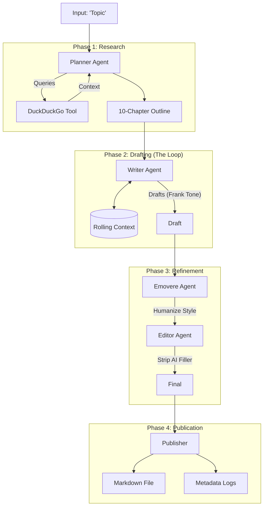

# Agentic Blog Writer (Capstone Project)

A local, multi-agent AI system that researches, plans, writes, and edits magazine-quality essays. 

**Powered by Llama 3.1 8B** running locally on an NVIDIA RTX 4060 via LM Studio.

## 🏆 Project Goals
- **Full Local Privacy:** 100% offline inference (no OpenAI/Anthropic keys).
- **Infinite Context:** Utilizes `q4_0` KV Cache Quantization for 53k+ token memory.
- **Agentic Workflow:** 5 specialized agents (Planner, Writer, Emovere, Editor, Publisher).
- **Anti-Hallucination:** Uses DuckDuckGo Search for grounding.

## 🏗 Architecture

## How It Works

### Planner:
Searches DuckDuckGo for the topic. If search fails, it falls back to internal knowledge. Generates a logical 10-chapter Table of Contents.

### Writer:
Iterates through chapters. Injects the entire manuscript so far into the context window (up to 53k tokens) to ensure continuity and avoid repetition. Writes in a "Senior Editor" persona.

### Emovere:
A style-transfer agent that removes robotic phrases ("In conclusion", "delve into") and applies a "Frank/Magazine" tone.

### Editor:
A strict rule-based agent that fixes formatting and strips conversational filler.

### Publisher:
Saves the final essay and a metadata file containing the research logs.

## Setup & Requirements

### Hardware:

GPU: NVIDIA RTX 3060/4060 or better (8GB VRAM min).

RAM: 16GB+.

### Software:

LM Studio: Load meta-llama-3.1-8b-instruct-q4_k_m.gguf.

Enable GPU Offload (Max).

Set Context Length to 45000 or higher.

Start Local Server on Port 1234.

Also pls enable KV cache quant to q4_0